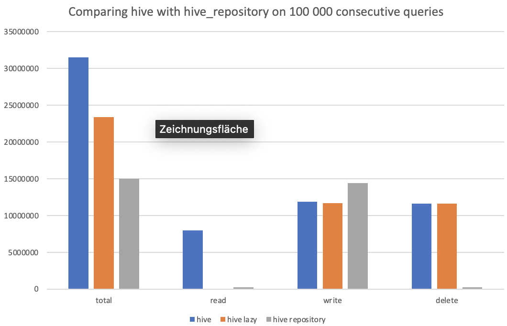

# Benchmark
Using the code in this directory we will get some benchmarks comparing hive with HiveRepository

Running this benchmark on a `MacBook Pro (13-inch, 2017, Four Thunderbolt 3 Ports)`with `macOS Big Sur v11.6 (20G165)` `3,1 GHz Dual-Core Intel Core i5` Processor and `8 GB 2133 MHz LPDDR3` RAM yielded the follwoing results:

```json
[{
  "total": 31494112,
  "read": 7970142,
  "write": 11882355,
  "delete": 11641615,
  "total1": 314.94112,
  "read1": 79.70142,
  "write1": 118.82355,
  "delete1": 116.41615
}, {
  "total": 23383742,
  "read": 74527,
  "write": 11658913,
  "delete": 11650302,
  "total1": 233.83742,
  "read1": 0.74527,
  "write1": 116.58913,
  "delete1": 116.50302
}, {
  "total": 14970445,
  "read": 263192,
  "write": 14437176,
  "delete": 270077,
  "total1": 149.70445,
  "read1": 2.63192,
  "write1": 144.37176,
  "delete1": 2.70077
}]
```

